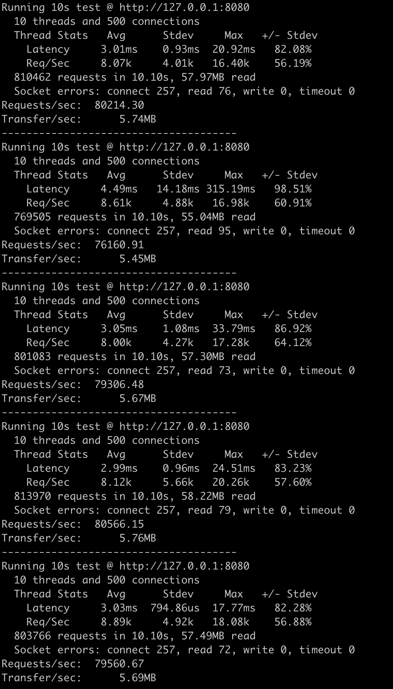
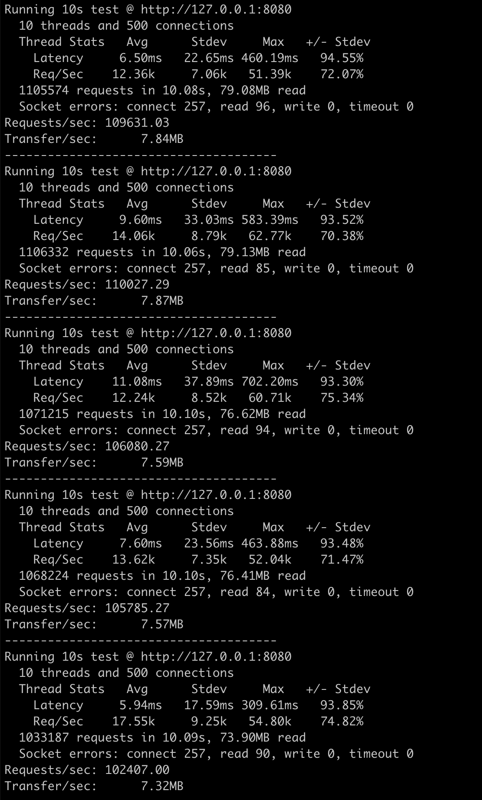

English | [中文](./README_CN.md)

<div align="center">
	<h1>LAW</h1>
	<p>A lightweight elevate I/O with Asynchronous io.Writer<p>
	<p>Boost performance and efficiency effortlessly for logging, streaming, and more.</p>
	
</div>

[](https://goreportcard.com/report/github.com/shengyanli1982/law)
[](https://github.com/shengyanli1982/law/actions)
[](https://pkg.go.dev/github.com/shengyanli1982/law)

# Introduction

**Log Asynchronous Writer** is a lightweight log asynchronous writer designed for high-concurrency scenarios, such as HTTP servers and gRPC servers.

`LAW` utilizes a `double buffer` design, allowing it to write data to the `deque` asynchronously and flush the buffer to the `io.Writer` when it is full. This design significantly improves the writer's performance and reduces pressure on the `io.Writer`.

With just two APIs, `Write` and `Stop`, `LAW` offers simplicity and ease of use. The `Write` API is used to write log data to the buffer, while the `Stop` API is used to stop the writer.

`LAW` can be used with any implementation of the `io.Writer` interface that requires asynchronous writing, such as `zap`, `logrus`, `klog`, `zerolog`, and more.

# Advantages

-   Simple and user-friendly
-   No external dependencies required
-   High performance with minimal memory usage
-   Optimized for efficient garbage collection
-   Supports customizable action callback functions

# Installation

```bash
go get github.com/shengyanli1982/law
```

# Quick Start

`LAW` is designed to be straightforward and user-friendly. To begin, create a writer and use the `Write` method to write log data to the buffer. When you're ready to stop the writer, simply call the `Stop` method.

Additionally, `LAW` offers a `Config` struct that enables customization of the writer's behavior. You can utilize the `WithXXX` methods to configure various features. For more information, refer to the **Features** section.

### Example

```go
package main

import (
	"os"
	"time"
	"strconv"

	law "github.com/shengyanli1982/law"
)

func main() {
	// 创建一个新的配置
	// Create a new configuration
	conf := NewConfig()

	// 使用 os.Stdout 和配置创建一个新的 WriteAsyncer 实例
	// Create a new WriteAsyncer instance using os.Stdout and the configuration
	w := NewWriteAsyncer(os.Stdout, conf)
	// 使用 defer 语句确保在 main 函数退出时停止 WriteAsyncer
	// Use a defer statement to ensure that WriteAsyncer is stopped when the main function exits
	defer w.Stop()

	// 循环 10 次，每次都将一个数字写入 WriteAsyncer
	// Loop 10 times, each time write a number to WriteAsyncer
	for i := 0; i < 10; i++ {
		_, _ = w.Write([]byte(strconv.Itoa(i))) // 将当前的数字写入 WriteAsyncer
	}

	// 等待 1 秒，以便我们可以看到 WriteAsyncer 的输出
	// Wait for 1 second so we can see the output of WriteAsyncer
	time.Sleep(time.Second)
}
```

# Features

`LAW` also has some interesting features. It is designed to be easily extensible, allowing you to write your own asynchronous writer effortlessly.

## 1. Callback

`LAW` supports action callback functions. You can specify a callback function when creating a writer, and this function will be called when the writer performs certain actions.

```go
// Callback 是一个接口，定义了队列操作和写操作的回调函数。
// Callback is an interface that defines callback functions for queue operations and write operations.
type Callback interface {
	// OnWriteFailed 是一个方法，当写操作失败时会被调用。
	// 它接受两个参数：一个字节切片（表示写入内容）和一个错误（表示失败的原因）。
	// OnWriteFailed is a method that is called when a write operation fails.
	// It takes two parameters: a byte slice (indicating the content to be written) and an error (indicating the reason for the failure).
	OnWriteFailed(content []byte, reason error)
}
```

> [!TIP]
>
> Callback functions are optional. If you don't need them, you can pass `nil` when creating a writer, and the callback function will not be called.
>
> You can use the `WithCallback` method to set the callback function.

### Example

```go
package main

import (
	"os"
	"time"
	"strconv"

	law "github.com/shengyanli1982/law"
)

// callback 是一个实现了 law.Callback 接口的结构体
// callback is a struct that implements the law.Callback interface
type callback struct{}

// OnWriteFailed 是当数据写入失败时的回调函数
// OnWriteFailed is the callback function when data writing fails
func (c *callback) OnWriteFailed(b []byte, err error) {
	fmt.Printf("write failed msg: %s, err: %v\n", string(b), err) // 输出写入失败的消息和错误
}

func main() {
	// 创建一个新的配置，并设置回调函数
	// Create a new configuration and set the callback function
	conf := NewConfig().WithCallback(&callback{})

	// 使用 os.Stdout 和配置创建一个新的 WriteAsyncer 实例
	// Create a new WriteAsyncer instance using os.Stdout and the configuration
	w := NewWriteAsyncer(os.Stdout, conf)
	// 使用 defer 语句确保在 main 函数退出时停止 WriteAsyncer
	// Use a defer statement to ensure that WriteAsyncer is stopped when the main function exits
	defer w.Stop()

	// 循环 10 次，每次都将一个数字写入 WriteAsyncer
	// Loop 10 times, each time write a number to WriteAsyncer
	for i := 0; i < 10; i++ {
		_, _ = w.Write([]byte(strconv.Itoa(i))) // 将当前的数字写入 WriteAsyncer
	}

	// 等待 1 秒，以便我们可以看到 WriteAsyncer 的输出
	// Wait for 1 second so we can see the output of WriteAsyncer
	time.Sleep(time.Second)
}
```

## 2. Capacity

`LAW` utilizes a `double buffer` to write log data, allowing you to specify the buffer's capacity when creating a writer.

> [!TIP]
>
> -   The default capacity of the `deque` is unlimited, meaning it can hold an unlimited amount of log data.
> -   The default capacity of the `bufferIo` is `2k`, meaning it can hold up to `2k` log data. If the buffer becomes full, `LAW` will automatically flush the buffer to the `io.Writer`. `2k` is a recommended choice, but you can customize it.
>
> You can use the `WithBufferSize` method to adjust the size of the bufferIo.

### Example

```go
package main

import (
	"os"
	"time"
	"strconv"

	law "github.com/shengyanli1982/law"
)

func main() {
	// 创建一个新的配置，并设置缓冲区大小为 1024
	// Create a new configuration and set the buffer size to 1024
	conf := NewConfig().WithBufferSize(1024)

	// 使用 os.Stdout 和配置创建一个新的 WriteAsyncer 实例
	// Create a new WriteAsyncer instance using os.Stdout and the configuration
	w := NewWriteAsyncer(os.Stdout, conf)
	// 使用 defer 语句确保在 main 函数退出时停止 WriteAsyncer
	// Use a defer statement to ensure that WriteAsyncer is stopped when the main function exits
	defer w.Stop()

	// 循环 10 次，每次都将一个数字写入 WriteAsyncer
	// Loop 10 times, each time write a number to WriteAsyncer
	for i := 0; i < 10; i++ {
		_, _ = w.Write([]byte(strconv.Itoa(i))) // 将当前的数字写入 WriteAsyncer
	}

	// 等待 1 秒，以便我们可以看到 WriteAsyncer 的输出
	// Wait for 1 second so we can see the output of WriteAsyncer
	time.Sleep(time.Second)
}
```

## 3. Custom Queue

`LAW` provides the flexibility to customize the queue used for storing log data. You have the option to implement your own queue and pass it to the writer during initialization.

> [!TIP]
>
> By default, `LAW` uses a `lockfree` queue that stores log data in a chain of byte buffers.
>
> You can use the `WithQueue` method to set a custom queue.

**Queue Interface**

```go
// Queue 是一个接口，定义了队列的基本操作：Push 和 Pop。
// Queue is an interface that defines the basic operations of a queue: Push and Pop.
type Queue interface {
	// Push 方法用于将值添加到队列中。
	// The Push method is used to add a value to the queue.
	Push(value interface{})

	// Pop 方法用于从队列中取出一个值。
	// The Pop method is used to take a value out of the queue.
	Pop() interface{}
}
```

# Examples

Here are some examples of how to use LAW. For more examples, you can also refer to the `examples` directory.

## 1. Zap

`LAW` can be used to write log data to `zap` asynchronously.

**Code**

```go
package main

import (
	"os"
	"strconv"
	"time"

	"go.uber.org/zap"
	"go.uber.org/zap/zapcore"

	law "github.com/shengyanli1982/law"
)

func main() {
	// 使用 os.Stdout 创建一个新的 WriteAsyncer 实例
	// Create a new WriteAsyncer instance using os.Stdout
	aw := law.NewWriteAsyncer(os.Stdout, nil)
	// 使用 defer 语句确保在 main 函数退出时停止 WriteAsyncer
	// Use a defer statement to ensure that WriteAsyncer is stopped when the main function exits
	defer aw.Stop()

	// 创建一个 zapcore.EncoderConfig 实例，用于配置 zap 的编码器
	// Create a zapcore.EncoderConfig instance to configure the encoder of zap
	encoderCfg := zapcore.EncoderConfig{
		MessageKey:     "msg",                         // 消息的键名
		LevelKey:       "level",                       // 级别的键名
		NameKey:        "logger",                      // 记录器名的键名
		EncodeLevel:    zapcore.LowercaseLevelEncoder, // 级别的编码器
		EncodeTime:     zapcore.ISO8601TimeEncoder,    // 时间的编码器
		EncodeDuration: zapcore.StringDurationEncoder, // 持续时间的编码器
	}

	// 使用 WriteAsyncer 创建一个 zapcore.WriteSyncer 实例
	// Create a zapcore.WriteSyncer instance using WriteAsyncer
	zapAsyncWriter := zapcore.AddSync(aw)
	// 使用编码器配置和 WriteSyncer 创建一个 zapcore.Core 实例
	// Create a zapcore.Core instance using the encoder configuration and WriteSyncer
	zapCore := zapcore.NewCore(zapcore.NewJSONEncoder(encoderCfg), zapAsyncWriter, zapcore.DebugLevel)
	// 使用 Core 创建一个 zap.Logger 实例
	// Create a zap.Logger instance using Core
	zapLogger := zap.New(zapCore)

	// 循环 10 次，每次都使用 zapLogger 输出一个数字
	// Loop 10 times, each time output a number using zapLogger
	for i := 0; i < 10; i++ {
		zapLogger.Info(strconv.Itoa(i)) // 输出当前的数字
	}

	// 等待 3 秒，以便我们可以看到 zapLogger 的输出
	// Wait for 3 seconds so we can see the output of zapLogger
	time.Sleep(3 * time.Second)
}
```

**Results**

```bash
$ go run demo.go
{"level":"info","msg":"0"}
{"level":"info","msg":"1"}
{"level":"info","msg":"2"}
{"level":"info","msg":"3"}
{"level":"info","msg":"4"}
{"level":"info","msg":"5"}
{"level":"info","msg":"6"}
{"level":"info","msg":"7"}
{"level":"info","msg":"8"}
{"level":"info","msg":"9"}
```

## 2. Logrus

`LAW` can be used to write log data to `logrus` asynchronously.

**Code**

```go
package main

import (
	"os"
	"time"

	law "github.com/shengyanli1982/law"
	"github.com/sirupsen/logrus"
)

func main() {
	// 使用 os.Stdout 创建一个新的 WriteAsyncer 实例
	// Create a new WriteAsyncer instance using os.Stdout
	aw := law.NewWriteAsyncer(os.Stdout, nil)
	// 使用 defer 语句确保在 main 函数退出时停止 WriteAsyncer
	// Use a defer statement to ensure that WriteAsyncer is stopped when the main function exits
	defer aw.Stop()

	// 将 logrus 的输出设置为我们创建的 WriteAsyncer
	// Set the output of logrus to the WriteAsyncer we created
	logrus.SetOutput(aw)

	// 循环 10 次，每次都使用 logrus 输出一个数字
	// Loop 10 times, each time output a number using logrus
	for i := 0; i < 10; i++ {
		logrus.Info(i) // 输出当前的数字
	}

	// 等待 3 秒，以便我们可以看到 logrus 的输出
	// Wait for 3 seconds so we can see the output of logrus
	time.Sleep(3 * time.Second)
}
```

**Results**

```bash
$ go run demo.go
time="2023-12-16T12:38:13+08:00" level=info msg=0
time="2023-12-16T12:38:13+08:00" level=info msg=1
time="2023-12-16T12:38:13+08:00" level=info msg=2
time="2023-12-16T12:38:13+08:00" level=info msg=3
time="2023-12-16T12:38:13+08:00" level=info msg=4
time="2023-12-16T12:38:13+08:00" level=info msg=5
time="2023-12-16T12:38:13+08:00" level=info msg=6
time="2023-12-16T12:38:13+08:00" level=info msg=7
time="2023-12-16T12:38:13+08:00" level=info msg=8
time="2023-12-16T12:38:13+08:00" level=info msg=9
```

## 3. klog

`LAW` can be used to write log data to `klog` asynchronously.

**Code**

```go
package main

import (
	"os"
	"time"

	law "github.com/shengyanli1982/law"
	"k8s.io/klog/v2"
)

func main() {
	// 使用 os.Stdout 创建一个新的 WriteAsyncer 实例
	// Create a new WriteAsyncer instance using os.Stdout
	aw := law.NewWriteAsyncer(os.Stdout, nil)
	// 使用 defer 语句确保在 main 函数退出时停止 WriteAsyncer
	// Use a defer statement to ensure that WriteAsyncer is stopped when the main function exits
	defer aw.Stop()

	// 将 klog 的输出设置为我们创建的 WriteAsyncer
	// Set the output of klog to the WriteAsyncer we created
	klog.SetOutput(aw)

	// 循环 10 次，每次都使用 klog 输出一个数字
	// Loop 10 times, each time output a number using klog
	for i := 0; i < 10; i++ {
		klog.Info(i) // 输出当前的数字
	}

	// 等待 3 秒，以便我们可以看到 klog 的输出
	// Wait for 3 seconds so we can see the output of klog
	time.Sleep(3 * time.Second)
}
```

**Results**

```bash
$ go run demo.go
I1216 12:36:07.637943   17388 demo.go:18] 0
I1216 12:36:07.638105   17388 demo.go:18] 1
I1216 12:36:07.638109   17388 demo.go:18] 2
I1216 12:36:07.638113   17388 demo.go:18] 3
I1216 12:36:07.638117   17388 demo.go:18] 4
I1216 12:36:07.638121   17388 demo.go:18] 5
I1216 12:36:07.638125   17388 demo.go:18] 6
I1216 12:36:07.638128   17388 demo.go:18] 7
I1216 12:36:07.638132   17388 demo.go:18] 8
I1216 12:36:07.638136   17388 demo.go:18] 9
```

## 4. Zerolog

`LAW` can be used to write log data to `zerolog` asynchronously.

**Code**

```go
package main

import (
	"os"
	"time"

	"github.com/rs/zerolog"
	law "github.com/shengyanli1982/law"
)

func main() {
	// 使用 os.Stdout 创建一个新的 WriteAsyncer 实例
	// Create a new WriteAsyncer instance using os.Stdout
	aw := law.NewWriteAsyncer(os.Stdout, nil)
	// 使用 defer 语句确保在 main 函数退出时停止 WriteAsyncer
	// Use a defer statement to ensure that WriteAsyncer is stopped when the main function exits
	defer aw.Stop()

	// 使用 WriteAsyncer 创建一个新的 zerolog.Logger 实例，并添加时间戳
	// Create a new zerolog.Logger instance using WriteAsyncer and add a timestamp
	log := zerolog.New(aw).With().Timestamp().Logger()

	// 循环 10 次，每次都使用 log 输出一个数字和一条消息
	// Loop 10 times, each time output a number and a message using log
	for i := 0; i < 10; i++ {
		log.Info().Int("i", i).Msg("hello") // 输出当前的数字和一条消息
	}

	// 等待 3 秒，以便我们可以看到 log 的输出
	// Wait for 3 seconds so we can see the output of log
	time.Sleep(3 * time.Second)
}
```

**Results**

```bash
$ go run demo.go
{"level":"info","i":0,"time":"2023-12-16T12:39:45+08:00","message":"hello"}
{"level":"info","i":1,"time":"2023-12-16T12:39:45+08:00","message":"hello"}
{"level":"info","i":2,"time":"2023-12-16T12:39:45+08:00","message":"hello"}
{"level":"info","i":3,"time":"2023-12-16T12:39:45+08:00","message":"hello"}
{"level":"info","i":4,"time":"2023-12-16T12:39:45+08:00","message":"hello"}
{"level":"info","i":5,"time":"2023-12-16T12:39:45+08:00","message":"hello"}
{"level":"info","i":6,"time":"2023-12-16T12:39:45+08:00","message":"hello"}
{"level":"info","i":7,"time":"2023-12-16T12:39:45+08:00","message":"hello"}
{"level":"info","i":8,"time":"2023-12-16T12:39:45+08:00","message":"hello"}
{"level":"info","i":9,"time":"2023-12-16T12:39:45+08:00","message":"hello"}
```

# Benchmark

> [!IMPORTANT]
> The benchmark test results are provided for reference only. Please note that different hardware environments may yield different results.

### Environment

-   **OS**: macOS Big Sur 11.7.10
-   **CPU**: 3.3 GHz 8-Core Intel XEON E5 4627v2
-   **Memory**: 32 GB 1866 MHz DDR3
-   **Go**: go1.20.11 darwin/amd64

## 1. Base

The performance of `LAW` has been optimized and improved compared to `BlackHoleWriter` and `zapcore.AddSync(BlackHoleWriter)` since version `v0.1.3`.

**Before**

```bash
# go test -benchmem -run=^$ -bench ^Benchmark* github.com/shengyanli1982/law/benchmark

goos: darwin
goarch: amd64
pkg: github.com/shengyanli1982/law/benchmark
cpu: Intel(R) Xeon(R) CPU E5-4627 v2 @ 3.30GHz
BenchmarkBlackHoleWriter-8           	1000000000	         0.2871 ns/op	       0 B/op	       0 allocs/op
BenchmarkBlackHoleWriterParallel-8   	1000000000	         0.2489 ns/op	       0 B/op	       0 allocs/op
BenchmarkZapSyncWriter-8             	 3357697	       351.7 ns/op	       0 B/op	       0 allocs/op
BenchmarkZapSyncWriterParallel-8     	21949550	        59.52 ns/op	       0 B/op	       0 allocs/op
BenchmarkZapAsyncWriter-8            	  481237	      2133 ns/op	     932 B/op	       1 allocs/op
BenchmarkZapAsyncWriterParallel-8    	 1453645	       865.7 ns/op	    2074 B/op	       3 allocs/op
```

**After**

```bash
# go test -benchmem -run=^$ -bench ^Benchmark* github.com/shengyanli1982/law/benchmark

goos: darwin
goarch: amd64
pkg: github.com/shengyanli1982/law/benchmark
cpu: Intel(R) Xeon(R) CPU E5-4627 v2 @ 3.30GHz
BenchmarkBlackHoleWriter-8           	1000000000	         0.2905 ns/op	       0 B/op	       0 allocs/op
BenchmarkBlackHoleWriterParallel-8   	1000000000	         0.2557 ns/op	       0 B/op	       0 allocs/op
BenchmarkLogAsyncWriter-8            	 4515822	       229.1 ns/op	      61 B/op	       3 allocs/op
BenchmarkLogAsyncWriterParallel-8    	 4604298	       251.1 ns/op	      61 B/op	       3 allocs/op
BenchmarkZapSyncWriter-8             	 3294104	       352.9 ns/op	       0 B/op	       0 allocs/op
BenchmarkZapSyncWriterParallel-8     	23504499	        59.52 ns/op	       0 B/op	       0 allocs/op
BenchmarkZapAsyncWriter-8            	 2173760	       551.0 ns/op	      56 B/op	       2 allocs/op
BenchmarkZapAsyncWriterParallel-8    	 4663755	       258.1 ns/op	      56 B/op	       2 allocs/op
```

`LAW` employs a `double buffer` strategy for logging, which may slightly impact performance compared to `zapcore.AddSync(BlackHoleWriter)`. This is because `zap`, when integrated with `LAW`, utilizes zap's writer buffer indirectly. `zap` passes the data to `LAW` through a `deque` before flushing it to the `io.Writer (BlackHoleWriter)`. As a result, the performance of `LAW` is the sum of `BenchmarkZapSyncWriter` and `BenchmarkLogAsyncWriter`, equivalent to `BenchmarkZapAsyncWriter`.

## 2. Http Server

Integrate `law` into the HTTP server to simulate real-world business scenarios and compare its performance with other loggers.

### 2.1. SyncWriter

**SyncWriter**: `os.Stdout`

```go
package main

import (
	"net/http"
	"os"

	"go.uber.org/zap"
	"go.uber.org/zap/zapcore"
)

func main() {
	// 创建一个zapcore.EncoderConfig，用于配置日志编码器
	// Create a zapcore.EncoderConfig to configure the log encoder
	encoderCfg := zapcore.EncoderConfig{
		MessageKey:     "msg",                         // 消息的键名，Key name for the message
		LevelKey:       "level",                       // 日志级别的键名，Key name for the log level
		NameKey:        "logger",                      // 记录器名称的键名，Key name for the logger name
		EncodeLevel:    zapcore.LowercaseLevelEncoder, // 日志级别的编码器，Encoder for the log level
		EncodeTime:     zapcore.ISO8601TimeEncoder,    // 时间的编码器，Encoder for the time
		EncodeDuration: zapcore.StringDurationEncoder, // 持续时间的编码器，Encoder for the duration
	}

	// 创建一个zapcore.WriteSyncer，将日志写入标准输出
	// Create a zapcore.WriteSyncer that writes logs to the standard output
	zapSyncWriter := zapcore.AddSync(os.Stdout)
	// 创建一个zapcore.Core，使用JSON编码器和标准输出
	// Create a zapcore.Core using the JSON encoder and the standard output
	zapCore := zapcore.NewCore(zapcore.NewJSONEncoder(encoderCfg), zapSyncWriter, zapcore.DebugLevel)
	// 创建一个zap.Logger，使用上面创建的zapcore.Core
	// Create a zap.Logger using the zapcore.Core created above
	zapLogger := zap.New(zapCore)

	// 注册一个HTTP处理函数，当访问"/"时，记录一条信息日志
	// Register an HTTP handler function, when accessing "/", log an info message
	http.HandleFunc("/", func(w http.ResponseWriter, r *http.Request) {
		zapLogger.Info("hello")
	})
	// 启动HTTP服务器，监听8080端口
	// Start the HTTP server, listen on port 8080
	_ = http.ListenAndServe(":8080", nil)
}
```

Use `wrk` to test the performance of the http server.

```bash
#!/bin/bash

times=0

while [ $times -lt 5 ]
do
    wrk -c 500 -t 10 http://127.0.0.1:8080
    times=$[$times+1]
    sleep 2
    echo "--------------------------------------"
done
```

**Results:**



### 2.2. AsyncWriter

**LAW**: `NewWriteAsyncer(os.Stdout, nil)`

```go
package main

import (
	"net/http"
	"os"

	"go.uber.org/zap"
	"go.uber.org/zap/zapcore"

	x "github.com/shengyanli1982/law"
)

func main() {
	// 创建一个新的异步写入器，输出到标准输出
	// Create a new asynchronous writer that outputs to standard output
	aw := x.NewWriteAsyncer(os.Stdout, nil)
	// 确保在程序结束时停止异步写入器
	// Ensure the asynchronous writer is stopped when the program ends
	defer aw.Stop()

	// 创建一个zapcore.EncoderConfig，用于配置日志编码器
	// Create a zapcore.EncoderConfig to configure the log encoder
	encoderCfg := zapcore.EncoderConfig{
		MessageKey:     "msg",                         // 消息的键名，Key name for the message
		LevelKey:       "level",                       // 日志级别的键名，Key name for the log level
		NameKey:        "logger",                      // 记录器名称的键名，Key name for the logger name
		EncodeLevel:    zapcore.LowercaseLevelEncoder, // 日志级别的编码器，Encoder for the log level
		EncodeTime:     zapcore.ISO8601TimeEncoder,    // 时间的编码器，Encoder for the time
		EncodeDuration: zapcore.StringDurationEncoder, // 持续时间的编码器，Encoder for the duration
	}

	// 创建一个zapcore.WriteSyncer，将日志写入异步写入器
	// Create a zapcore.WriteSyncer that writes logs to the asynchronous writer
	zapSyncWriter := zapcore.AddSync(aw)
	// 创建一个zapcore.Core，使用JSON编码器和异步写入器
	// Create a zapcore.Core using the JSON encoder and the asynchronous writer
	zapCore := zapcore.NewCore(zapcore.NewJSONEncoder(encoderCfg), zapSyncWriter, zapcore.DebugLevel)
	// 创建一个zap.Logger，使用上面创建的zapcore.Core
	// Create a zap.Logger using the zapcore.Core created above
	zapLogger := zap.New(zapCore)

	// 注册一个HTTP处理函数，当访问"/"时，记录一条信息日志
	// Register an HTTP handler function, when accessing "/", log an info message
	http.HandleFunc("/", func(w http.ResponseWriter, r *http.Request) {
		zapLogger.Info("hello")
	})
	// 启动HTTP服务器，监听8080端口
	// Start the HTTP server, listen on port 8080
	_ = http.ListenAndServe(":8080", nil)
}
```

Use `wrk` to test the performance of the http server.

```bash
#!/bin/bash

times=0

while [ $times -lt 5 ]
do
    wrk -c 500 -t 10 http://127.0.0.1:8080
    times=$[$times+1]
    sleep 2
    echo "--------------------------------------"
done
```

**Results:**


