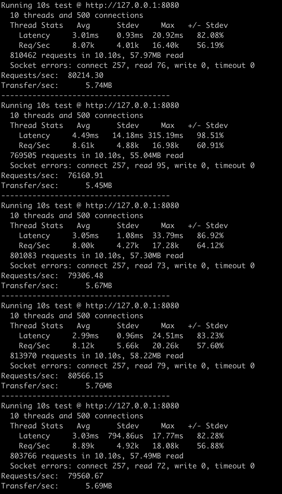
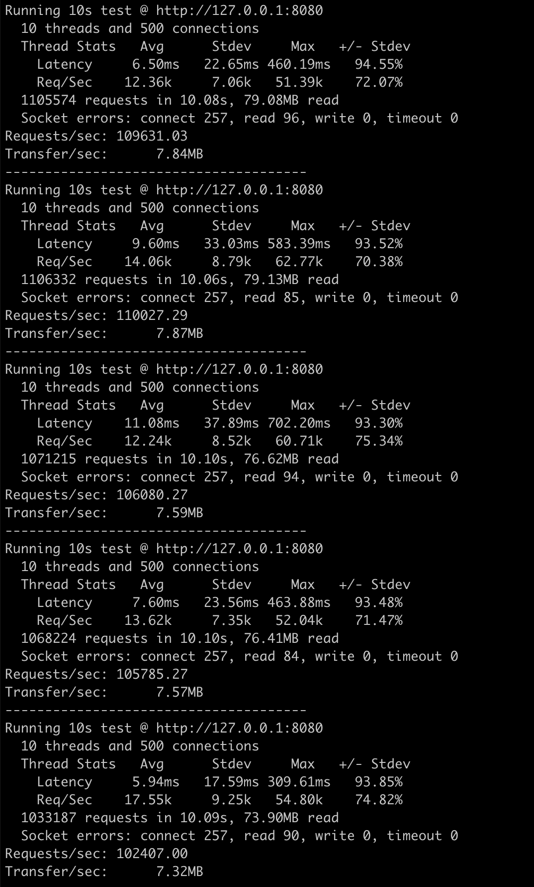

<div align="center">
	<h1>LAW</h1>
	<p><strong>Lightweight Asynchronous Writer</strong> &mdash; A Lightweight Asynchronous io.Writer to Elevate I/O Performance</p>
	<p>Decouple your application from I/O latency with a single <code>io.Writer</code> drop-in.</p>
	
</div>

[](https://goreportcard.com/report/github.com/shengyanli1982/law)
[](https://github.com/shengyanli1982/law/actions)
[](https://pkg.go.dev/github.com/shengyanli1982/law)
[](https://deepwiki.com/shengyanli1982/law)

# Introduction

**LAW** (Log Asynchronous Writer) is a lightweight, zero-dependency Go library that turns any `io.Writer` into a fully asynchronous writer. It is designed for high-concurrency scenarios such as HTTP servers, gRPC services, and any workload where I/O latency must not block the hot path.

With just two APIs -- `Write` and `Stop` -- LAW acts as a transparent drop-in replacement. It can be composed with any logging framework that accepts an `io.Writer`, including `zap`, `logrus`, `klog`, and `zerolog`.

# Architecture

Internally, LAW has three decoupled stages:

1. **MPSC Queue** -- A multi-producer, single-consumer queue built on `sync.Mutex` / `sync.Cond` + linked list + `sync.Pool` for node recycling. Callers (`Write`) push `*bytes.Buffer` entries into the queue without blocking on downstream I/O.
2. **BufferPool** -- A size-hinted `bytes.Buffer` pool (`sync.Pool`) that pre-allocates buffers on the caller side, avoiding re-allocation on the consumer side.
3. **Poller** -- A single background goroutine that drains the queue, coalesces writes into a `bufio.Writer`, and flushes to the underlying `io.Writer`. The poller is driven by a configurable heartbeat interval and idle timeout.

Data flow:

```
Caller (goroutine N)                     Poller (single goroutine)
      |                                          |
  bufferpool.Get()                               |
      |                                          |
  Write(p) -> queue.Push(buf)                    |
      |                                          |
  return (non-blocking)          queue.Pop() -> bufio.Write -> Flush -> io.Writer
```

# Why Asynchronous

The core value of LAW is **latency decoupling**: the caller's `Write()` returns as soon as the data is enqueued, regardless of how slow the underlying I/O is.

The following benchmark demonstrates this property. With a simulated slow I/O backend (10 parallel goroutines, Apple M1 Max, Go 1.25):

| Backend IO Latency | ZapLockedWriterParallel | LawAsyncParallel | Speedup |
| ------------------ | ----------------------: | ---------------: | ------: |
| 100 ns             |               895 ns/op |    **386 ns/op** |    2.3x |
| 500 ns             |             3,481 ns/op |    **386 ns/op** |    9.0x |
| 1 us               |             3,565 ns/op |    **382 ns/op** |    9.3x |

**Key observation**: LAW's caller-side latency stays nearly constant (~382-386 ns/op) across a 10x increase in I/O latency (100 ns to 1 us). A synchronous writer, by contrast, scales linearly with I/O cost. This is the defining characteristic of asynchronous I/O -- the hot path is insulated from I/O jitter.

Even in single-goroutine (serial) mode, LAW delivers a significant advantage:

| Backend IO Latency | ZapLockedWriter Serial | LawAsyncWriter Serial |
| ------------------ | ---------------------: | --------------------: |
| 1 us               |            3,485 ns/op |         **194 ns/op** |

# Advantages

- **Latency-insensitive writes** -- Caller `Write()` returns in ~185-375 ns (serial/parallel) regardless of backend speed, as confirmed by SlowIO benchmarks.
- **Zero external dependencies** -- Only the Go standard library.
- **GC-friendly** -- `BufferPool` (`sync.Pool`) recycles `bytes.Buffer` objects; the MPSC queue reuses linked-list nodes via its own `sync.Pool`.
- **Production-grade concurrency** -- MPSC queue is safe for any number of concurrent writers; a single poller goroutine serializes downstream I/O.
- **Drop-in `io.Writer`** -- Works with `zap`, `logrus`, `klog`, `zerolog`, and any `io.Writer`-compatible sink.
- **Configurable** -- Buffer size, heartbeat interval, idle timeout, custom queue, and write-failure callbacks.

# Installation

```bash
go get github.com/shengyanli1982/law
```

# Quick Start

Create a `WriteAsyncer`, write data, and call `Stop()` when done.

```go
package main

import (
	"os"
	"strconv"
	"time"

	law "github.com/shengyanli1982/law"
)

func main() {
	// Create a new configuration
	conf := law.NewConfig()

	// Create a new WriteAsyncer backed by os.Stdout
	w := law.NewWriteAsyncer(os.Stdout, conf)
	defer w.Stop()

	// Write 10 entries
	for i := 0; i < 10; i++ {
		_, _ = w.Write([]byte(strconv.Itoa(i)))
	}

	// Wait for the poller to flush
	time.Sleep(time.Second)
}
```

# Features

LAW is designed to be easily extensible. The following sections describe the configurable features.

## 1. Callback

LAW supports an action callback interface. You can register a callback that is invoked when specific events occur (e.g., a write failure).

```go
// Callback defines callback functions for write operations.
type Callback interface {
	// OnWriteFailed is called when a write to the underlying io.Writer fails.
	OnWriteFailed(content []byte, reason error)
}
```

> [!TIP]
>
> Callbacks are optional. If you do not need them, pass `nil` (or omit `WithCallback`), and LAW uses a no-op implementation.

### Example

```go
package main

import (
	"fmt"
	"os"
	"strconv"
	"time"

	law "github.com/shengyanli1982/law"
)

// callback implements law.Callback
type callback struct{}

func (c *callback) OnWriteFailed(b []byte, err error) {
	fmt.Printf("write failed: %s, error: %v\n", string(b), err)
}

func main() {
	// Configure a callback
	conf := law.NewConfig().WithCallback(&callback{})

	w := law.NewWriteAsyncer(os.Stdout, conf)
	defer w.Stop()

	for i := 0; i < 10; i++ {
		_, _ = w.Write([]byte(strconv.Itoa(i)))
	}

	time.Sleep(time.Second)
}
```

## 2. Capacity (Buffer Size)

LAW uses a `bufio.Writer` to coalesce small writes before flushing to the underlying `io.Writer`. You can configure the buffer size at creation time.

> [!TIP]
>
> - The MPSC queue has no capacity limit by default.
> - The `bufio.Writer` default size is 2 KB, which balances throughput and memory. Adjust via `WithBufferSize`.

### Example

```go
package main

import (
	"os"
	"strconv"
	"time"

	law "github.com/shengyanli1982/law"
)

func main() {
	// Set the bufio.Writer buffer size to 1024 bytes
	conf := law.NewConfig().WithBufferSize(1024)

	w := law.NewWriteAsyncer(os.Stdout, conf)
	defer w.Stop()

	for i := 0; i < 10; i++ {
		_, _ = w.Write([]byte(strconv.Itoa(i)))
	}

	time.Sleep(time.Second)
}
```

## 3. Heartbeat and Idle Timeout

The poller goroutine is driven by two timers:

- **Heartbeat interval** -- How often the poller checks the queue for new data (default: `500ms`).
- **Idle timeout** -- How long the poller waits without new data before force-flushing the buffer (default: `5s`).

### Example

```go
package main

import (
	"os"
	"strconv"
	"time"

	law "github.com/shengyanli1982/law"
)

func main() {
	conf := law.NewConfig().
		WithHeartbeatInterval(200 * time.Millisecond).
		WithIdleTimeout(3 * time.Second)

	w := law.NewWriteAsyncer(os.Stdout, conf)
	defer w.Stop()

	for i := 0; i < 10; i++ {
		_, _ = w.Write([]byte(strconv.Itoa(i)))
	}

	time.Sleep(time.Second)
}
```

## 4. Custom Queue

LAW's internal queue is pluggable. The default is an MPSC queue built on `mutex/cond + linked list + sync.Pool`. You can substitute your own implementation.

> [!TIP]
>
> Use `WithQueue` to provide a custom queue. The queue must implement the `law.Queue` interface:

```go
// Queue defines the basic operations of a queue: Push and Pop.
type Queue interface {
	// Push adds a value to the queue.
	Push(value *bytes.Buffer)

	// Pop removes and returns a value from the queue.
	Pop() *bytes.Buffer
}
```

# Examples

The following examples show how to integrate LAW with popular Go logging frameworks. More examples are available in the `examples/` directory.

## 1. Zap

```go
package main

import (
	"os"
	"strconv"
	"time"

	"go.uber.org/zap"
	"go.uber.org/zap/zapcore"

	law "github.com/shengyanli1982/law"
)

func main() {
	// Create a WriteAsyncer backed by os.Stdout
	aw := law.NewWriteAsyncer(os.Stdout, nil)
	defer aw.Stop()

	encoderCfg := zapcore.EncoderConfig{
		MessageKey:     "msg",
		LevelKey:       "level",
		NameKey:        "logger",
		EncodeLevel:    zapcore.LowercaseLevelEncoder,
		EncodeTime:     zapcore.ISO8601TimeEncoder,
		EncodeDuration: zapcore.StringDurationEncoder,
	}

	// Wrap the WriteAsyncer as a zapcore.WriteSyncer
	zapAsyncWriter := zapcore.AddSync(aw)
	zapCore := zapcore.NewCore(zapcore.NewJSONEncoder(encoderCfg), zapAsyncWriter, zapcore.DebugLevel)
	zapLogger := zap.New(zapCore)

	for i := 0; i < 10; i++ {
		zapLogger.Info(strconv.Itoa(i))
	}

	// Wait for the poller to flush all entries
	time.Sleep(3 * time.Second)
}
```

**Output:**

```bash
$ go run demo.go
{"level":"info","msg":"0"}
{"level":"info","msg":"1"}
{"level":"info","msg":"2"}
{"level":"info","msg":"3"}
{"level":"info","msg":"4"}
{"level":"info","msg":"5"}
{"level":"info","msg":"6"}
{"level":"info","msg":"7"}
{"level":"info","msg":"8"}
{"level":"info","msg":"9"}
```

## 2. Logrus

```go
package main

import (
	"os"
	"time"

	"github.com/sirupsen/logrus"
	law "github.com/shengyanli1982/law"
)

func main() {
	aw := law.NewWriteAsyncer(os.Stdout, nil)
	defer aw.Stop()

	logrus.SetOutput(aw)

	for i := 0; i < 10; i++ {
		logrus.Info(i)
	}

	time.Sleep(3 * time.Second)
}
```

**Output:**

```bash
$ go run demo.go
time="2023-12-16T12:38:13+08:00" level=info msg=0
time="2023-12-16T12:38:13+08:00" level=info msg=1
time="2023-12-16T12:38:13+08:00" level=info msg=2
time="2023-12-16T12:38:13+08:00" level=info msg=3
time="2023-12-16T12:38:13+08:00" level=info msg=4
time="2023-12-16T12:38:13+08:00" level=info msg=5
time="2023-12-16T12:38:13+08:00" level=info msg=6
time="2023-12-16T12:38:13+08:00" level=info msg=7
time="2023-12-16T12:38:13+08:00" level=info msg=8
time="2023-12-16T12:38:13+08:00" level=info msg=9
```

## 3. klog

```go
package main

import (
	"os"
	"time"

	"k8s.io/klog/v2"
	law "github.com/shengyanli1982/law"
)

func main() {
	aw := law.NewWriteAsyncer(os.Stdout, nil)
	defer aw.Stop()

	klog.SetOutput(aw)

	for i := 0; i < 10; i++ {
		klog.Info(i)
	}

	time.Sleep(3 * time.Second)
}
```

**Output:**

```bash
$ go run demo.go
I1216 12:36:07.637943   17388 demo.go:18] 0
I1216 12:36:07.638105   17388 demo.go:18] 1
I1216 12:36:07.638109   17388 demo.go:18] 2
I1216 12:36:07.638113   17388 demo.go:18] 3
I1216 12:36:07.638117   17388 demo.go:18] 4
I1216 12:36:07.638121   17388 demo.go:18] 5
I1216 12:36:07.638125   17388 demo.go:18] 6
I1216 12:36:07.638128   17388 demo.go:18] 7
I1216 12:36:07.638132   17388 demo.go:18] 8
I1216 12:36:07.638136   17388 demo.go:18] 9
```

## 4. Zerolog

```go
package main

import (
	"os"
	"time"

	"github.com/rs/zerolog"
	law "github.com/shengyanli1982/law"
)

func main() {
	aw := law.NewWriteAsyncer(os.Stdout, nil)
	defer aw.Stop()

	log := zerolog.New(aw).With().Timestamp().Logger()

	for i := 0; i < 10; i++ {
		log.Info().Int("i", i).Msg("hello")
	}

	time.Sleep(3 * time.Second)
}
```

**Output:**

```bash
$ go run demo.go
{"level":"info","i":0,"time":"2023-12-16T12:39:45+08:00","message":"hello"}
{"level":"info","i":1,"time":"2023-12-16T12:39:45+08:00","message":"hello"}
{"level":"info","i":2,"time":"2023-12-16T12:39:45+08:00","message":"hello"}
{"level":"info","i":3,"time":"2023-12-16T12:39:45+08:00","message":"hello"}
{"level":"info","i":4,"time":"2023-12-16T12:39:45+08:00","message":"hello"}
{"level":"info","i":5,"time":"2023-12-16T12:39:45+08:00","message":"hello"}
{"level":"info","i":6,"time":"2023-12-16T12:39:45+08:00","message":"hello"}
{"level":"info","i":7,"time":"2023-12-16T12:39:45+08:00","message":"hello"}
{"level":"info","i":8,"time":"2023-12-16T12:39:45+08:00","message":"hello"}
{"level":"info","i":9,"time":"2023-12-16T12:39:45+08:00","message":"hello"}
```

# Benchmark

**Hardware**: darwin/arm64, Apple M1 Max, Go 1.25

## BlackHole Baseline (in-memory sink, 0 I/O latency)

`BlackHoleWriter` is a no-op writer that discards all data. This measures the pure overhead of each layer with zero I/O cost.

| Benchmark                        | ns/op | B/op | allocs/op |
| -------------------------------- | ----: | ---: | --------: |
| BlackHoleWriter                  |  0.32 |    0 |         0 |
| BlackHoleWriterParallel          |  0.18 |    0 |         0 |
| LogAsyncWriter (LAW, serial)     |  ~185 |  134 |         1 |
| LogAsyncWriterParallel (LAW)     |  ~375 |  216 |         2 |
| ZapSyncWriter (serial)           |  ~179 |    0 |         0 |
| ZapSyncWriterParallel            |   ~34 |    0 |         0 |
| ZapAsyncWriter (Zap+LAW, serial) |  ~335 |  127 |         1 |
| ZapAsyncWriterParallel (Zap+LAW) |  ~473 |  219 |         2 |

### Fairness Note: `ZapSyncWriterParallel`

The `ZapSyncWriterParallel` result (~34 ns/op) is anomalously low because `zapcore.AddSync()` does **not** add a mutex. This is the official Zap contract -- the caller is responsible for serializing access or wrapping with `zapcore.Lock()`. In real concurrent usage, `zapcore.Lock()` is mandatory, so the fair baseline for concurrent Zap is:

| Benchmark                                     | ns/op | B/op | allocs/op |
| --------------------------------------------- | ----: | ---: | --------: |
| ZapLockedWriter (with `zapcore.Lock`, serial) |  ~185 |    0 |         0 |
| ZapLockedWriterParallel (with `zapcore.Lock`) |  ~170 |    0 |         0 |

## SlowIO -- Simulated I/O Latency (parallel, 10 goroutines)

This is the most realistic comparison. A `slowWriter` injects a configurable sleep to simulate real backend I/O latency.

| I/O Latency | ZapLockedWriterParallel |       LawAsyncParallel |  Speedup |
| ----------- | ----------------------: | ---------------------: | -------: |
| 100 ns      |      895 ns/op, 0 alloc | **386 ns/op**, 2 alloc | **2.3x** |
| 500 ns      |    3,481 ns/op, 0 alloc | **386 ns/op**, 2 alloc | **9.0x** |
| 1 us        |    3,565 ns/op, 0 alloc | **382 ns/op**, 2 alloc | **9.3x** |

## SlowIO Serial (single goroutine)

| I/O Latency | ZapLockedWriter Serial | LawAsyncWriter Serial |
| ----------- | ---------------------: | --------------------: |
| 1 us        |            3,485 ns/op |         **194 ns/op** |

## Real I/O (`/dev/null`, parallel)

`/dev/null` exercises the real kernel write path while discarding data, providing a ground-truth comparison against the in-memory BlackHole.

| Benchmark                       | ns/op | B/op | allocs/op |
| ------------------------------- | ----: | ---: | --------: |
| DevNull_ZapLockedParallel       |  ~884 |    0 |         0 |
| DevNull_LawAsyncParallel        |  ~373 |  226 |         2 |
| DevNull_ZapAsyncWithLawParallel |  ~469 |  217 |         2 |

### Architecture Trade-off

LAW introduces one additional allocation per `Write()` call because the caller-side `bytes.Buffer` is allocated from the `BufferPool`. When LAW is used as Zap's backend, Zap's internal `buffer.Pool` performs a first allocation, and LAW's `BufferPool` performs a second -- resulting in a two-stage buffer chain. This is a deliberate design choice: the extra ~200 B/op is the cost of decoupling the caller from I/O latency, and it pays for itself as soon as the backend is slower than a few hundred nanoseconds (as shown in the SlowIO results above).

## HTTP Server

Integrate LAW into an HTTP server to simulate a real-world workload:

### SyncWriter

```go
package main

import (
	"net/http"
	"os"

	"go.uber.org/zap"
	"go.uber.org/zap/zapcore"
)

func main() {
	encoderCfg := zapcore.EncoderConfig{
		MessageKey:     "msg",
		LevelKey:       "level",
		NameKey:        "logger",
		EncodeLevel:    zapcore.LowercaseLevelEncoder,
		EncodeTime:     zapcore.ISO8601TimeEncoder,
		EncodeDuration: zapcore.StringDurationEncoder,
	}

	zapSyncWriter := zapcore.AddSync(os.Stdout)
	zapCore := zapcore.NewCore(zapcore.NewJSONEncoder(encoderCfg), zapSyncWriter, zapcore.DebugLevel)
	zapLogger := zap.New(zapCore)

	http.HandleFunc("/", func(w http.ResponseWriter, r *http.Request) {
		zapLogger.Info("hello")
	})
	_ = http.ListenAndServe(":8080", nil)
}
```

### AsyncWriter (LAW)

```go
package main

import (
	"net/http"
	"os"

	"go.uber.org/zap"
	"go.uber.org/zap/zapcore"

	law "github.com/shengyanli1982/law"
)

func main() {
	aw := law.NewWriteAsyncer(os.Stdout, nil)
	defer aw.Stop()

	encoderCfg := zapcore.EncoderConfig{
		MessageKey:     "msg",
		LevelKey:       "level",
		NameKey:        "logger",
		EncodeLevel:    zapcore.LowercaseLevelEncoder,
		EncodeTime:     zapcore.ISO8601TimeEncoder,
		EncodeDuration: zapcore.StringDurationEncoder,
	}

	zapAsyncWriter := zapcore.AddSync(aw)
	zapCore := zapcore.NewCore(zapcore.NewJSONEncoder(encoderCfg), zapAsyncWriter, zapcore.DebugLevel)
	zapLogger := zap.New(zapCore)

	http.HandleFunc("/", func(w http.ResponseWriter, r *http.Request) {
		zapLogger.Info("hello")
	})
	_ = http.ListenAndServe(":8080", nil)
}
```

### wrk Test Script

```bash
#!/bin/bash

times=0

while [ $times -lt 5 ]
do
    wrk -c 500 -t 10 http://127.0.0.1:8080
    times=$[$times+1]
    sleep 2
    echo "--------------------------------------"
done
```

**SyncWriter Results:**



**AsyncWriter Results:**


